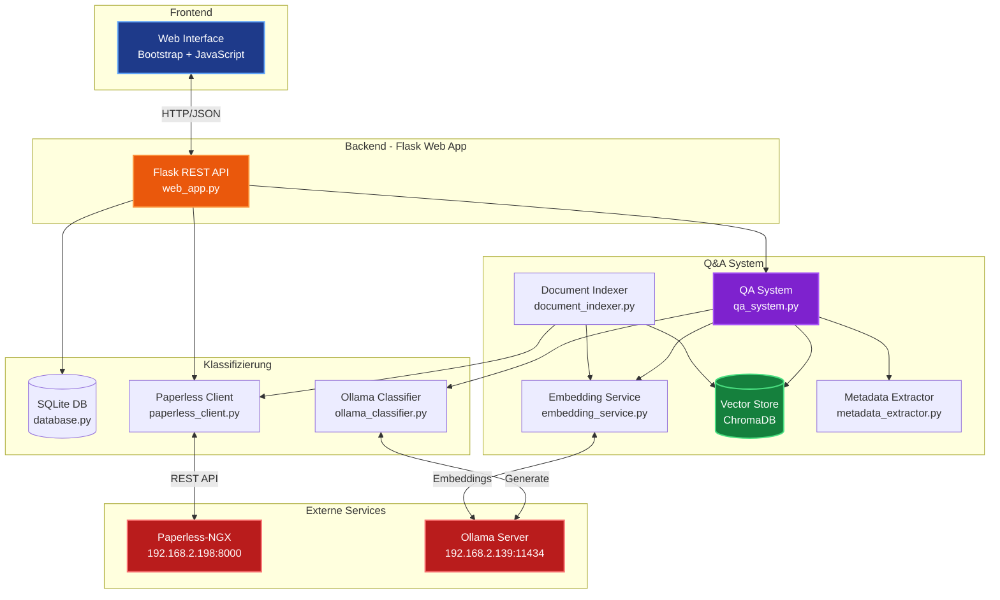
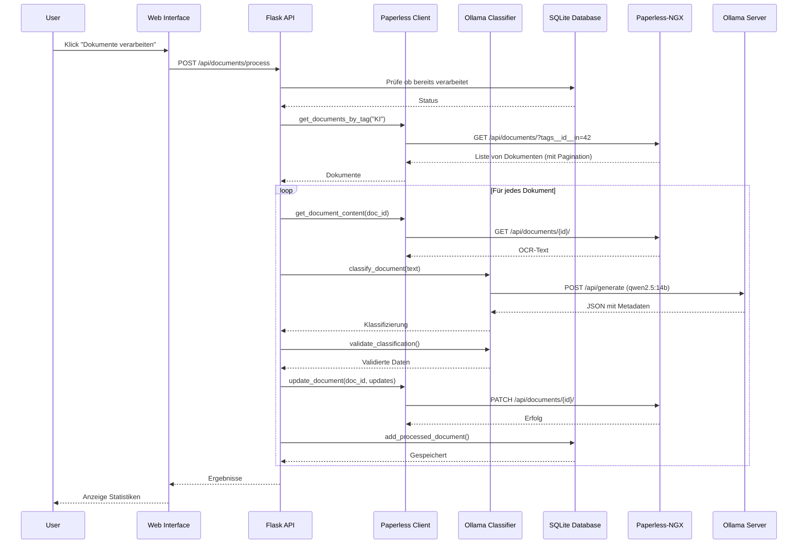
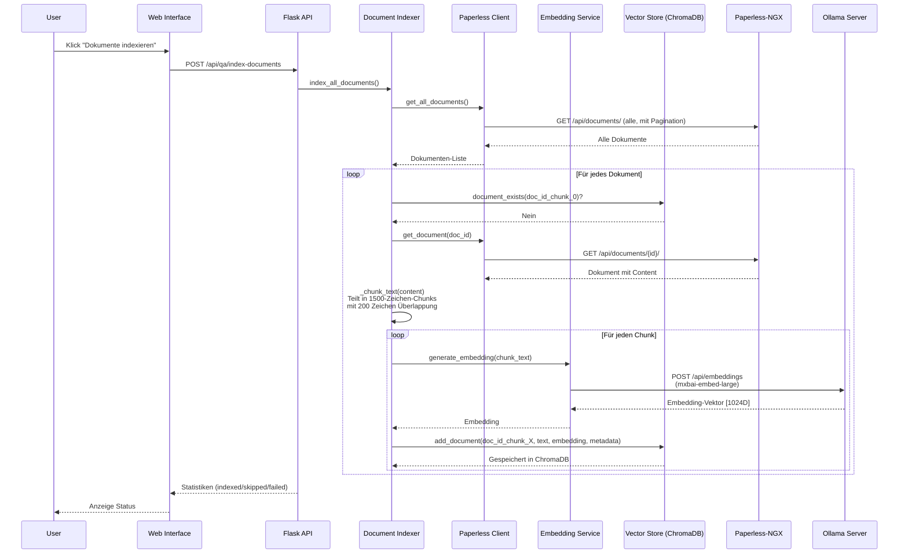
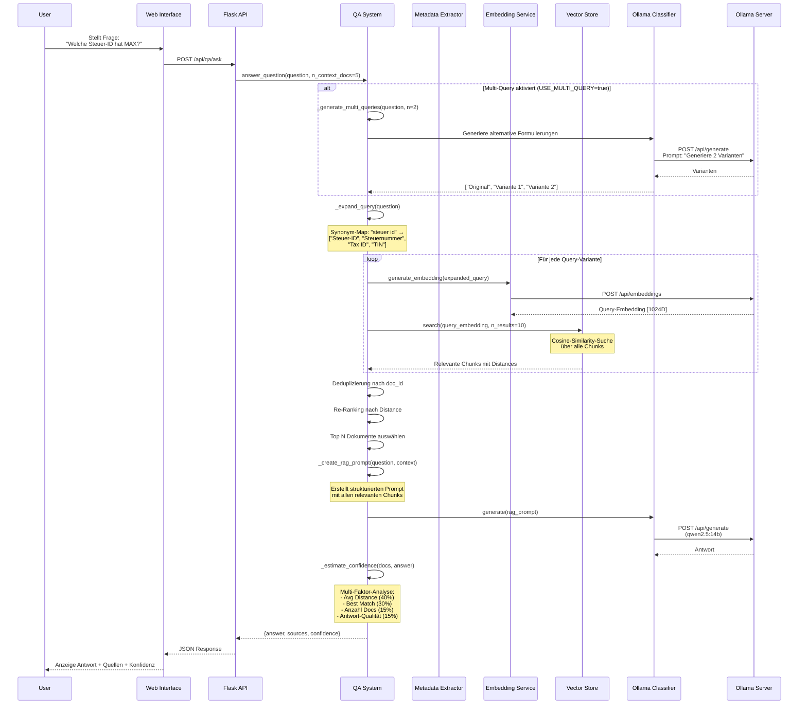
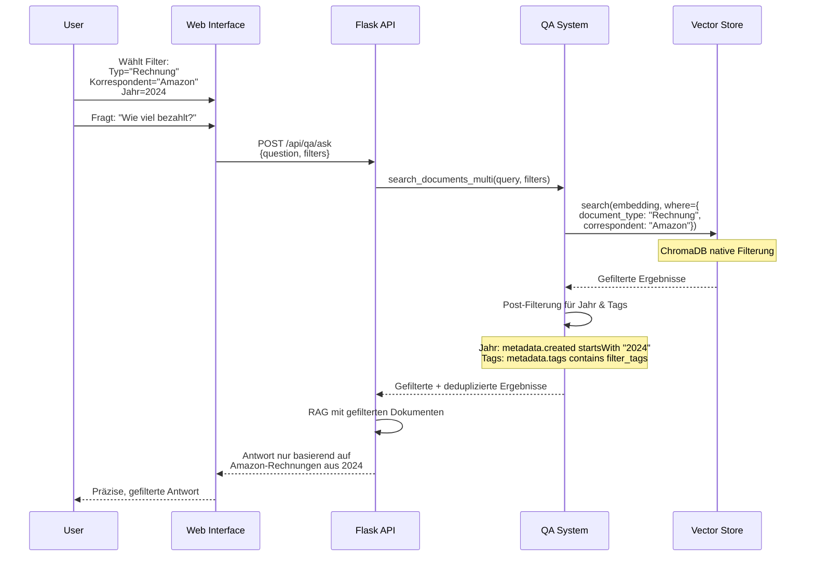
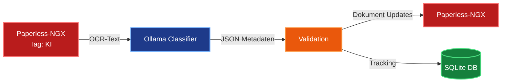
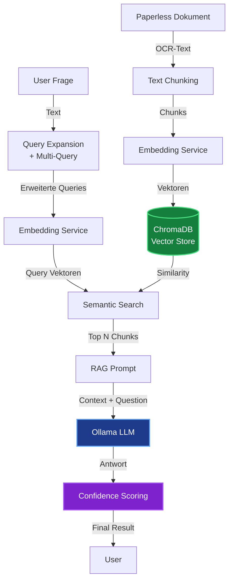
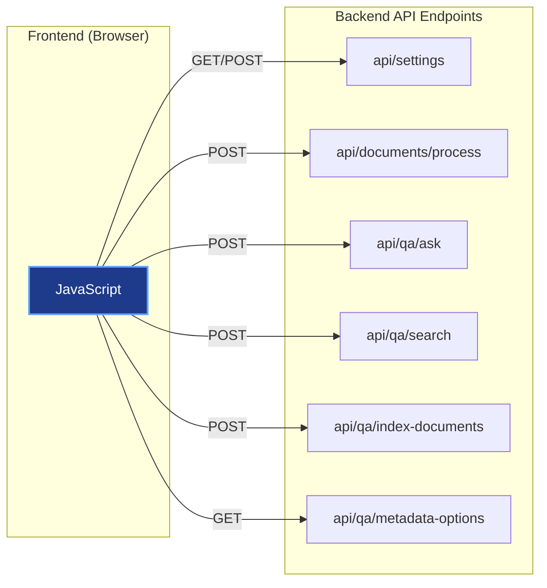
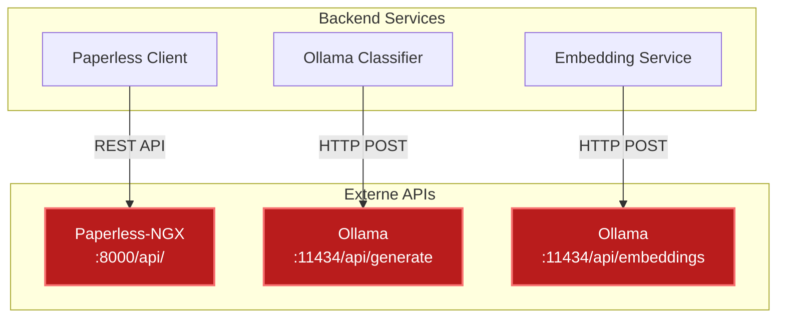

# Paperless-NGX AI Agent - Architektur-Dokumentation

## 📋 Übersicht

Der Paperless-NGX AI Agent besteht aus zwei Hauptsystemen:
1. **Dokumenten-Klassifizierung**: Automatische Metadaten-Extraktion
2. **Q&A-System**: Semantische Suche und natürlichsprachliche Fragen

## 🏗️ System-Architektur



## 🔄 Hauptprozesse

### 1. Dokumenten-Klassifizierung




**Komponenten-Details:**

- **paperless_client.py**: Kommunikation mit Paperless-NGX API
  - `get_documents_by_tag()`: Holt Dokumente mit "KI" Tag (mit Pagination)
  - `get_document_content()`: Holt OCR-Text
  - `update_document()`: Aktualisiert Metadaten
  - `get_all_tags/correspondents/document_types()`: Metadaten-Verwaltung

- **ollama_classifier.py**: LLM-Integration
  - `classify_document()`: Sendet Text an Ollama für Klassifizierung
  - `validate_classification()`: Prüft ob Werte in config.py existieren
  - `generate()`: Allgemeine Text-Generierung für Q&A

- **database.py**: Persistenz
  - Speichert verarbeitete Dokumente (keine Duplikate)
  - Tracking von Erfolg/Fehler
  - Statistiken für Dashboard

### 2. Q&A-System - Dokumenten-Indexierung



**Komponenten-Details:**

- **document_indexer.py**: Dokument-Indexierung
  - `index_all_documents()`: Indexiert alle Paperless-Dokumente
  - `_chunk_text()`: Teilt lange Dokumente in überlappende Chunks
  - `index_document()`: Indexiert einzelnes Dokument mit allen Chunks
  - Smart Chunking bei Satzgrenzen (`.` und `\n`)

- **embedding_service.py**: Embedding-Generierung
  - Kommuniziert mit Ollama Embedding API
  - Unterstützt verschiedene Modelle (mxbai-embed-large, nomic-embed-text)
  - Caching für Performance

- **vector_store.py**: Persistente Vektor-Datenbank
  - ChromaDB für semantische Suche
  - Speichert Embeddings + Metadaten + Text
  - Unterstützt Chunk-basierte Dokumente
  - Deduplizierung basierend auf doc_id_original

### 3. Q&A-System - Frage beantworten



**Komponenten-Details:**

- **qa_system.py**: Hauptlogik für Q&A
  - `answer_question()`: RAG-Pipeline (Retrieval + Augmentation + Generation)
  - `_generate_multi_queries()`: Generiert alternative Frageformulierungen
  - `_expand_query()`: Synonym-Expansion (hardcoded + optional LLM)
  - `search_documents()`: Semantische Suche mit Filtern
  - `search_documents_multi()`: Multi-Query mit Deduplizierung
  - `_estimate_confidence()`: 4-Faktor Konfidenz-Bewertung

- **metadata_extractor.py**: Intelligente Filter-Extraktion
  - Extrahiert Filter aus natürlichsprachigen Fragen
  - Hybrid: Regex (schnell) + LLM (intelligent)
  - Erkennt: Dokumenttyp, Korrespondent, Jahr, Tags

### 4. Erweiterte Suche mit Filtern



## 📁 Datei-Struktur & Verantwortlichkeiten

```
paperless_ai_agent/
│
├── 🌐 Frontend
│   ├── templates/index.html          # Web-UI (Bootstrap 5)
│   └── static/js/app.js               # Frontend-Logik (JavaScript)
│
├── 🔧 Backend Core
│   ├── web_app.py                     # Flask REST API (Haupteinstieg)
│   ├── main.py                        # CLI für Batch-Verarbeitung
│   └── config.py                      # Konfiguration (Typen, Tags, etc.)
│
├── 📄 Klassifizierung
│   ├── paperless_client.py            # Paperless-NGX API Client
│   ├── ollama_classifier.py           # Ollama LLM Integration
│   └── database.py                    # SQLite für verarbeitete Dokumente
│
├── 🤖 Q&A System
│   ├── qa_system.py                   # Hauptlogik (RAG, Multi-Query)
│   ├── embedding_service.py           # Ollama Embeddings
│   ├── vector_store.py                # ChromaDB Wrapper
│   ├── document_indexer.py            # Dokument-Chunking & Indexierung
│   └── metadata_extractor.py          # Filter-Extraktion aus Queries
│
├── 🐳 Deployment
│   ├── Dockerfile                     # Container-Image
│   ├── docker-compose.yml             # Service-Definition
│   ├── docker-entrypoint.sh           # Startup-Script
│   └── requirements.txt               # Python Dependencies
│
└── 📝 Dokumentation
    ├── README.md                      # Benutzer-Dokumentation
    ├── ARCHITECTURE.md                # Diese Datei
    └── .env.example                   # Konfigurations-Template
```

## 🔀 Datenflüsse

### Klassifizierungs-Datenfluss



### Q&A Datenfluss



## 🧩 Komponenten-Interaktionen

### Web Interface → Backend



### Backend → Externe Services



## 🗄️ Datenbanken & Persistenz

### SQLite Database Schema (database.py)

```sql
CREATE TABLE processed_documents (
    id INTEGER PRIMARY KEY AUTOINCREMENT,
    document_id INTEGER NOT NULL UNIQUE,
    document_title TEXT,
    classification_result TEXT,  -- JSON
    success BOOLEAN,
    error_message TEXT,
    processed_at TIMESTAMP DEFAULT CURRENT_TIMESTAMP
);

CREATE INDEX idx_document_id ON processed_documents(document_id);
CREATE INDEX idx_success ON processed_documents(success);
```

**Zweck:** Verhindert doppelte Verarbeitung, speichert Klassifizierungs-Historie

### ChromaDB Collections (vector_store.py)

```
Collection: "paperless_documents"
├── Documents (Chunks)
│   ├── id: "doc_123_chunk_0", "doc_123_chunk_1", ...
│   ├── embedding: [1024D float vector]
│   ├── document: "Text preview (500 chars)"
│   └── metadata:
│       ├── title: "2024-01-15_rechnung_amazon_MAX"
│       ├── correspondent: "Amazon"
│       ├── document_type: "Rechnung"
│       ├── created: "2024-01-15"
│       ├── tags: "MAX,wichtig"
│       ├── chunk_number: "0"
│       ├── total_chunks: "3"
│       └── doc_id_original: "123"
```

**Zweck:** Semantische Suche, RAG Context Retrieval

## ⚙️ Konfiguration & Environment

### Wichtige .env Variablen

```bash
# Paperless-NGX
PAPERLESS_URL=http://192.168.2.198:8000
PAPERLESS_TOKEN=your_token_here

# Ollama Server
OLLAMA_URL=http://192.168.2.139:11434
OLLAMA_MODEL=qwen2.5:14b-instruct       # LLM für Klassifizierung + Q&A
EMBEDDING_MODEL=mxbai-embed-large       # Embedding-Modell

# Q&A Features
USE_LLM_EXPANSION=false                 # LLM-basierte Query Expansion
USE_MULTI_QUERY=true                    # Multi-Query Approach (empfohlen!)
```

### Docker-Konfiguration

```yaml
# docker-compose.yml
services:
  paperless-ai-agent:
    build: .
    network_mode: host                  # Zugriff auf localhost:8000
    environment:
      - TZ=Europe/Berlin                # Timezone
    volumes:
      - ./data:/app/data                # Persistente Daten
      - ./logs:/app/logs                # Logs
    restart: unless-stopped
```

## 🚀 Performance-Optimierungen

### 1. Chunking-Strategie
- **Chunk-Größe**: 1500 Zeichen
- **Überlappung**: 200 Zeichen
- **Splitting**: An Satzgrenzen (`.` oder `\n`)
- **Vorteil**: 100% Dokument-Abdeckung, keine Information verloren

### 2. Multi-Query Approach
- **Varianten**: 2 alternative Formulierungen
- **Deduplizierung**: Nach `doc_id_original`
- **Re-Ranking**: Nach Similarity-Distance
- **Vorteil**: ~20-30% bessere Recall-Rate

### 3. Query Expansion
- **Hardcoded**: Schnelle Synonym-Map für häufige Begriffe
- **LLM-basiert**: Optional für unbekannte Begriffe
- **Vorteil**: Erkennt "Steuer-ID" = "Steuernummer" = "Tax ID"

### 4. Confidence Scoring
- **Multi-Faktor**: 4 unabhängige Metriken
- **Thresholds**: high ≥70%, medium ≥45%
- **Vorteil**: Zuverlässige Qualitäts-Einschätzung

### 5. Pagination
- **Alle API-Calls**: Vollständige Pagination
- **Page-Size**: 100 Dokumente pro Request
- **Vorteil**: Funktioniert mit >1000 Dokumenten

## 🔒 Sicherheit & Datenschutz

### Datenschutz
- ✅ **100% Lokal**: Alle Daten bleiben auf Ihrem Server
- ✅ **Keine Cloud**: Kein externes API-Gateway
- ✅ **Ollama Self-Hosted**: LLM läuft auf eigenem Server

### Sicherheits-Features
- ✅ **Token-basierte Auth**: Paperless-NGX API Token
- ✅ **Network Isolation**: Docker host network mode
- ✅ **Non-Root User**: Container läuft als User 1000
- ✅ **.env Protection**: Secrets nicht in Git

## 📊 Monitoring & Debugging

### Logging-Strategie

```python
# Alle Module nutzen Python logging
import logging
logger = logging.getLogger(__name__)

# Log-Level
logger.info("Normale Operation")
logger.warning("Warnung, aber fortsetzbar")
logger.error("Fehler, Dokument übersprungen")
logger.debug("Detaillierte Debug-Info")
```

### Log-Ausgaben

```bash
# Docker Logs
docker-compose logs -f

# Filterte Logs
docker-compose logs | grep "QASystem"
docker-compose logs | grep "ERROR"

# Log-Dateien
./logs/paperless_ai_agent.log
./data/processed_documents.db
./data/chromadb/
```

### Health Checks

```bash
# Container Status
docker-compose ps

# Embedding Test
curl http://localhost:5000/api/qa/test-embedding

# Paperless Connection
curl http://192.168.2.198:8000/api/documents/ \
  -H "Authorization: Token YOUR_TOKEN"

# Ollama Status
curl http://192.168.2.139:11434/api/tags
```

## 🎯 Best Practices

### Für Klassifizierung
1. **Modell**: qwen2.5:14b-instruct (beste Balance)
2. **Batch-Size**: 10-20 Dokumente pro Durchlauf
3. **Validation**: Immer config.py prüfen
4. **Error Handling**: Dokumente bei Fehler nicht blockieren

### Für Q&A
1. **Embedding-Modell**: mxbai-embed-large (beste Qualität)
2. **Multi-Query**: Aktiviert lassen (USE_MULTI_QUERY=true)
3. **Context Docs**: 3-5 Dokumente für Kontext
4. **Re-Indexierung**: Nach Embedding-Modell-Wechsel notwendig

### Für Performance
1. **Ollama RAM**: Mind. 8GB für qwen2.5:14b
2. **ChromaDB**: SSD für schnelle Vector-Suche
3. **Pagination**: Überall implementiert
4. **Caching**: Embedding-Service cached Requests

## 🔄 Update-Strategie

```bash
# 1. Neue Version pullen
git pull origin master

# 2. Dependencies aktualisieren
pip install -r requirements.txt

# 3. Docker neu bauen
docker-compose build

# 4. Migration falls nötig
# (z.B. ChromaDB Schema-Änderungen)

# 5. Container neu starten
docker-compose down
docker-compose up -d

# 6. Logs prüfen
docker-compose logs -f
```

## 📚 Weitere Ressourcen

- **GitHub**: https://github.com/GamboSY/paperless_ai_agent
- **Paperless-NGX Docs**: https://docs.paperless-ngx.com/
- **Ollama Docs**: https://ollama.com/
- **ChromaDB Docs**: https://docs.trychroma.com/

---

**Version**: 1.0.0
**Letzte Aktualisierung**: 2025-01-06
**Maintainer**: GamboSY
